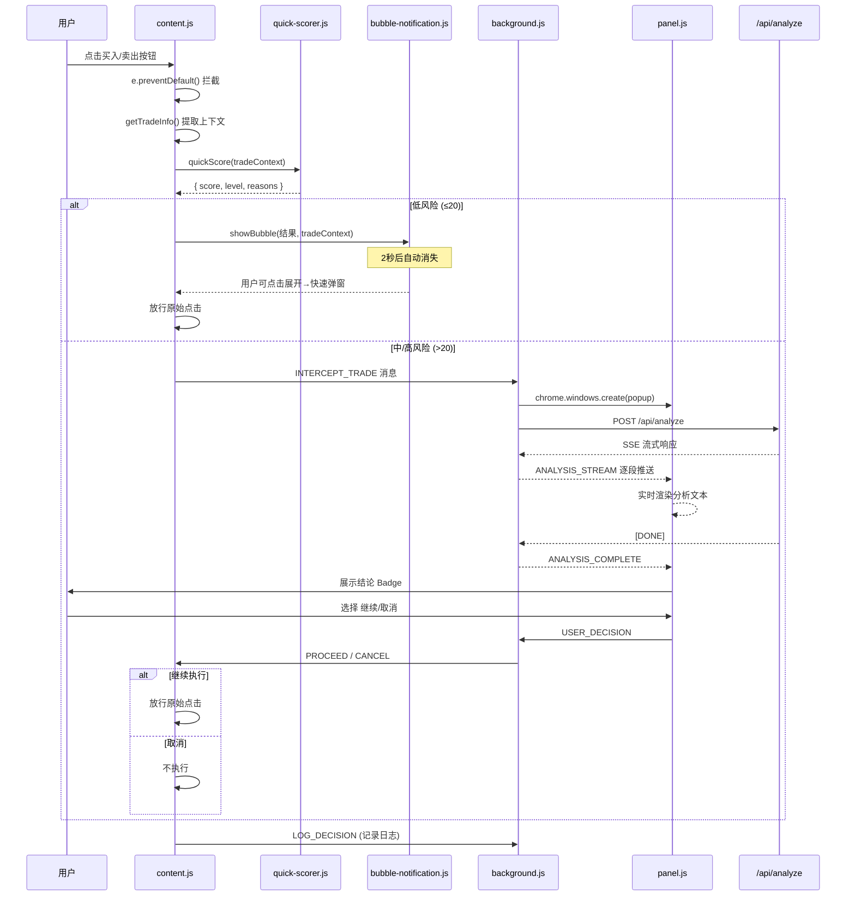

# Smart Intercept 技术设计文档

> 版本：v1.5.1 | 日期：2026-02-28 | 状态：已实现

---

## 1. 架构概览

### 1.1 系统架构

```
┌──────────────────────────── Chrome Extension ────────────────────────────┐
│                                                                          │
│  ┌──────────────┐                                                        │
│  │ content.js   │ ──拦截按钮点击──→ ┌──────────────────────┐             │
│  │ platforms.js │ ──提取交易上下文→ │ quick-scorer.js      │             │
│  │              │                   │ (Stage 1 本地评分)    │             │
│  └──────────────┘                   └──────────┬───────────┘             │
│                                                │                         │
│                              ┌─────────────────┼──────────────┐         │
│                              ▼                  ▼              ▼         │
│                          ≤20分              21-45分          >45分       │
│                        ┌────────┐       ┌──────────┐    ┌──────────┐    │
│                        │ bubble │       │ 通知 SW  │    │ 通知 SW  │    │
│                        │ 通知   │       │ 打开     │    │ 打开     │    │
│                        │ (2秒)  │       │ Popup    │    │ Popup    │    │
│                        └────────┘       └─────┬────┘    │ +强警告  │    │
│                                               │         └─────┬────┘    │
│                                               ▼               ▼         │
│  ┌──────────────┐                    ┌──────────────────────────────┐   │
│  │ background.js│ ←── 消息通信 ────→ │ intercept/intercept.js       │   │
│  │ (Service     │                    │ (极速拦截弹窗)                │   │
│  │  Worker)     │                    └──────────────────────────────┘   │
│  └──────┬───────┘                                                       │
│         │                                                                │
└─────────┼────────────────────────────────────────────────────────────────┘
          │ HTTP/SSE
          ▼
┌──────────────────────┐
│  Web App API Server  │
│  POST /api/analyze   │
│  GET  /api/ticker    │
│  POST /api/decision  │
└──────────────────────┘
```

### 1.2 消息流时序图



---

## 2. 模块详细设计

### 2.1 `content/quick-scorer.js`（新增）

Stage 1 快速风险评分引擎，在 content script 中本地运行。

```javascript
// 模块接口
window.OracleXQuickScorer = {
  /**
   * 快速风险评分
   * @param {Object} context - 交易上下文
   * @param {string} context.symbol - 交易对 (已标准化)
   * @param {string} context.price - 当前价格
   * @param {string} context.direction - 'buy' | 'sell'
   * @param {string} context.platform - 平台ID
   * @param {number|null} context.leverage - 杠杆倍数
   * @returns {Object} { score, level, reasons }
   */
  quickScore(context) {},

  /**
   * 获取缓存的 ticker 数据
   * @param {string} symbol
   * @returns {Object|null}
   */
  getCachedTicker(symbol) {},
};
```

**评分算法：**

```javascript
// 评分维度（总分 0-100）
const SCORE_WEIGHTS = {
  volatility: 30,    // 价格波动率 (24h)
  frequency: 25,     // 交易频率 (5分钟内同向操作次数)
  indicator: 25,     // RSI极端值
  leverage: 35,      // 杠杆倍数（v1.5.1 提升权重）
};

// 灵敏度阈值（v1.5.1 调低）
const SENSITIVITY_THRESHOLDS = {
  conservative: { low: 40, high: 70 },
  balanced: { low: 20, high: 45 },      // 20x首次即medium
  aggressive: { low: 10, high: 30 },
};

// 杠杆评分（v1.5.1 加强）
function scoreLeverage(leverage) {
  if (!leverage || leverage <= 1) return 0;
  if (leverage >= 50) return 35;  // 极端高杠杆
  if (leverage >= 20) return 25;  // 高杠杆
  if (leverage >= 10) return 18;  // 中高杠杆
  if (leverage >= 5) return 12;   // 中等杠杆
  if (leverage >= 3) return 5;
  return 2;
}
```

**Ticker 缓存策略：**
- Extension 启动时通过 background.js 批量拉取主要币种 ticker
- 缓存到 `chrome.storage.local`，TTL 60 秒
- content.js 通过消息从 background.js 获取缓存

### 2.2 `content/content.js`（重写）

核心改动：替换现有的简单冷静弹窗为智能拦截流程。

**关键变更：**

```diff
- // 旧：简单冷静倒计时
- const modal = createBlockerModal(platform, tradeType, tradeInfo);
- startCooldown(modal, () => { target.click(); });

+ // 新：两阶段智能分析
+ const tradeContext = extractTradeContext(platform, tradeType, tradeInfo);
+ const scoreResult = OracleXQuickScorer.quickScore(tradeContext);
+
+ if (scoreResult.level === 'low') {
+   OracleXBubble.show(scoreResult, e.clientX, e.clientY);
+   recordAndProceed(target, tradeContext, scoreResult);
+ } else {
+   // 通知 Service Worker 打开 Side Panel 进行深度分析
+   chrome.runtime.sendMessage({
+     type: 'INTERCEPT_TRADE',
+     data: { tradeContext, scoreResult }
+   });
+   // 等待 Service Worker 回传用户决策
+   awaitUserDecision(target, tradeContext);
+ }
```

**防重复拦截机制：**
- 用户选择"继续执行"后，在 `sessionStorage` 中设置白名单标记
- 同一按钮 3 秒内不再拦截
- 通过 `data-oraclex-proceed` 属性标记已放行的点击

**Symbol 标准化函数（在 `platforms.js` 中增强）：**

```javascript
const SYMBOL_ALIASES = {
  'XBTUSD': 'BTCUSDT',
  'XBT/USD': 'BTCUSDT',
  // Kraken 特殊映射
};

function normalizeSymbol(rawSymbol) {
  if (!rawSymbol) return null;
  // 移除空格、斜杠、连字符，转大写
  let symbol = rawSymbol.toUpperCase().replace(/[\s\/\-_]/g, '');
  // 检查别名
  if (SYMBOL_ALIASES[symbol]) return SYMBOL_ALIASES[symbol];
  // 确保以 USDT 结尾（如果没有报价币种）
  if (!symbol.match(/(USDT|USDC|BUSD|USD|BTC|ETH)$/)) {
    symbol += 'USDT';
  }
  return symbol;
}
```

### 2.3 `content/bubble-notification.js`（新增）

低风险场景下的轻量通知气泡。

```javascript
window.OracleXBubble = {
  /**
   * 显示气泡通知
   * @param {Object} scoreResult - 评分结果
   * @param {number} x - 鼠标 X 坐标
   * @param {number} y - 鼠标 Y 坐标
   */
  show(scoreResult, x, y) {},

  /**
   * 手动关闭
   */
  dismiss() {},
};
```

**UI 规格：**
- 尺寸：280px × auto，圆角 12px
- 位置：靠近点击位置，不遮挡按钮
- 动画：fadeIn 0.2s → 停留 1s → fadeOut 0.3s
- 内容：✅ 图标 + 风险评分 + 可展开详情链接
- 主题：半透明深色背景 + 绿色强调色

### 2.4 `background.js`（增强）

新增消息类型处理：

```javascript
// 新增处理的消息类型
const NEW_MESSAGE_HANDLERS = {
  // 来自 content.js 的拦截通知
  'INTERCEPT_TRADE': async (data, sender) => {
    // 1. 存入 session storage
    await chrome.storage.session.set({ oraclex_pending_intercept: payload });
    // 2. 打开 popup 弹窗（sidePanel.open 需要用户手势，故改用 windows.create）
    await chrome.windows.create({ url: 'intercept/intercept.html', type: 'popup' });
    // 2. 转发交易上下文到 Side Panel
    chrome.runtime.sendMessage({
      type: 'TRADE_INTERCEPTED',
      data: data
    });
    // 3. 启动 Stage 2 分析
    await startStage2Analysis(data.tradeContext);
  },

  // 来自 Side Panel 的用户决策
  'USER_DECISION': async (data) => {
    // 转发到 content.js
    chrome.tabs.query({ active: true, currentWindow: true }, (tabs) => {
      chrome.tabs.sendMessage(tabs[0].id, {
        type: data.proceed ? 'PROCEED_TRADE' : 'CANCEL_TRADE'
      });
    });
  },

  // Ticker 缓存请求 (content.js 调用)
  'GET_CACHED_TICKER': async (data) => {
    return getCachedTicker(data.symbol);
  },

  // 记录决策日志
  'LOG_INTERCEPT_DECISION': async (data) => {
    await saveDecisionLog(data);
  },
};
```

**Ticker 批量缓存：**

```javascript
// 定时刷新主要币种 ticker（每 60 秒）
const WATCHED_SYMBOLS = ['BTCUSDT', 'ETHUSDT', 'SOLUSDT', 'BNBUSDT', 'XRPUSDT'];
let tickerCache = {};

async function refreshTickerCache() {
  const apiBaseUrl = await getApiBaseUrl();
  for (const symbol of WATCHED_SYMBOLS) {
    try {
      const res = await fetch(`${apiBaseUrl}/api/ticker?symbol=${symbol}`);
      if (res.ok) tickerCache[symbol] = await res.json();
    } catch { /* 忽略 */ }
  }
}

// 启动时和每 60 秒刷新
refreshTickerCache();
setInterval(refreshTickerCache, 60000);
```

### 2.5 `intercept/intercept.js`（v1.5.1 新增）

专用极速拦截弹窗，替代原 Side Panel 拦截模式：

```javascript
// 从 session storage 读取拦截数据
const result = await chrome.storage.session.get('oraclex_pending_intercept');
renderTradeInfo(result);  // 即时渲染Quick Score+操作按钮

// 监听 AI 分析流（后台加载，不阻塞决策）
chrome.runtime.onMessage.addListener((msg) => {
  if (msg.type === 'ANALYSIS_STREAM') renderAIStream(msg.data);
  if (msg.type === 'ANALYSIS_COMPLETE') renderAIComplete(msg.data);
});

// 用户决策
function handleDecision(proceed) {
  chrome.runtime.sendMessage({ type: 'USER_DECISION', data: { proceed, tabId } });
  setTimeout(() => window.close(), 2000);  // 自动关窗
}
// 键盘快捷键: Enter=继续, Esc=取消
```

**新增 `renderInterceptedTrade()` 函数：**
- 展示"🛡️ 交易已拦截"标题
- 显示交易上下文卡片（平台 + 品种 + 价格 + 方向）
- 显示 Stage 1 快速评分结果
- 自动启动 Stage 2 AI 分析

### 2.6 `settings/settings.html` + `settings.js`（增强）

新增智能拦截配置区块：

```html
<!-- 新增配置区 -->
<section class="settings-section">
  <h2>🛡️ 智能拦截</h2>
  <label>
    <input type="checkbox" id="enableSmartIntercept" checked />
    启用智能拦截
  </label>
  <label>
    分析灵敏度
    <select id="interceptSensitivity">
      <option value="conservative">保守（仅高风险拦截）</option>
      <option value="balanced" selected>标准</option>
      <option value="aggressive">激进（所有操作分析）</option>
    </select>
  </label>
  <label>
    低风险通知方式
    <select id="lowRiskNotify">
      <option value="bubble" selected>气泡通知</option>
      <option value="silent">静默放行</option>
      <option value="off">关闭</option>
    </select>
  </label>
  <label>
    分析缓存时间(秒)
    <input type="number" id="cacheExpiry" value="300" min="60" max="600" />
  </label>
  <label>
    API 超时(秒)
    <input type="number" id="apiTimeout" value="5" min="3" max="15" />
  </label>
</section>
```

**新增设置字段（追加到 `DEFAULT_SETTINGS`）：**

```javascript
const SMART_INTERCEPT_DEFAULTS = {
  enableSmartIntercept: true,
  interceptSensitivity: 'balanced',   // conservative | balanced | aggressive
  lowRiskNotify: 'bubble',            // bubble | silent | off
  cacheExpiry: 300,                    // 秒
  apiTimeout: 5,                       // 秒
};
```

### 2.7 `lib/constants.ts`（增强）

新增 symbol 别名映射，供 API 端使用：

```typescript
export const SYMBOL_ALIASES: Record<string, string> = {
  'XBTUSD': 'BTCUSDT',
  'XBT/USD': 'BTCUSDT',
  'XBTUSDT': 'BTCUSDT',
};

export function normalizeSymbol(raw: string): string {
  const cleaned = raw.toUpperCase().replace(/[\s\/\-_]/g, '');
  return SYMBOL_ALIASES[cleaned] || cleaned;
}
```

---

## 3. 代码变更清单

| # | 文件 | 类型 | 行数估计 | 说明 |
|---|------|------|----------|------|
| 1 | `extension/content/quick-scorer.js` | 新增 | ~150 | Stage 1 快速评分引擎 |
| 2 | `extension/content/bubble-notification.js` | 新增 | ~100 | 低风险气泡通知 |
| 3 | `extension/content/content.js` | 重写 | ~200 | 智能拦截主流程 |
| 4 | `extension/content/platforms.js` | 增强 | +50 | symbol 标准化 + 增强 getTradeInfo |
| 5 | `extension/content/styles.css` | 增强 | +60 | 气泡通知样式 |
| 6 | `extension/background.js` | 增强 | +100 | 新消息路由 + ticker 缓存 |
| 7 | `extension/sidepanel/panel.js` | 增强 | +80 | 自动接收拦截数据 |
| 8 | `extension/sidepanel/index.html` | 微调 | +10 | 拦截模式 UI 元素 |
| 9 | `extension/settings/settings.html` | 增强 | +30 | 智能拦截配置区 |
| 10 | `extension/settings/settings.js` | 增强 | +20 | 新配置字段读写 |
| 11 | `extension/manifest.json` | 微调 | +5 | 可能追加权限 |
| 12 | `lib/constants.ts` | 增强 | +15 | symbol 别名映射 |

**预估总行数：~820 行（新增 + 修改）**

---

## 4. 接口设计

### 4.1 Extension 内部消息协议

#### 4.1.1 Content Script → Service Worker

```typescript
// 拦截通知
{
  type: 'INTERCEPT_TRADE',
  data: {
    tradeContext: {
      symbol: string,       // 标准化后的交易对，如 "BTCUSDT"
      rawSymbol: string,    // 原始提取值，如 "BTC/USDT"
      price: string,        // 当前价格
      direction: 'buy' | 'sell',
      platform: string,     // 平台ID
      leverage: number | null,
      amount: string | null,
      orderType: string | null,
    },
    scoreResult: {
      score: number,        // 0-100
      level: 'low' | 'medium' | 'high',
      reasons: string[],    // 评分原因列表
    }
  }
}

// 获取缓存 ticker
{
  type: 'GET_CACHED_TICKER',
  data: { symbol: string }
}

// 记录决策日志
{
  type: 'LOG_INTERCEPT_DECISION',
  data: {
    timestamp: string,
    platform: string,
    symbol: string,
    direction: string,
    price: string,
    quickScore: number,
    aiRiskLevel: string | null,
    userAction: 'proceed' | 'cancel' | 'auto_pass',
    analysisText: string | null,
  }
}
```

#### 4.1.2 Service Worker → Content Script

```typescript
// 放行交易
{ type: 'PROCEED_TRADE' }

// 取消交易
{ type: 'CANCEL_TRADE' }
```

#### 4.1.3 Service Worker → Side Panel

```typescript
// 交易被拦截
{
  type: 'TRADE_INTERCEPTED',
  data: {
    tradeContext: { ... },   // 同上
    scoreResult: { ... },    // 同上
  }
}

// 复用现有消息类型
{ type: 'ANALYSIS_STREAM', data: { content, fullText } }
{ type: 'ANALYSIS_COMPLETE', data: { fullText } }
{ type: 'ANALYSIS_ERROR', data: { error, code, requestId } }
```

#### 4.1.4 Side Panel → Service Worker

```typescript
// 用户操作决策
{
  type: 'USER_DECISION',
  data: {
    proceed: boolean,
    tradeContext: { ... }
  }
}
```

### 4.2 Web App API（无新增接口）

复用现有接口，无需新增：

| 接口 | 用途 | 调用方 |
|------|------|--------|
| `POST /api/analyze` | Stage 2 AI 深度分析 | background.js |
| `GET /api/ticker` | 获取实时 ticker | background.js (缓存) |
| `POST /api/decision` | NoFOMO 决策评估 | background.js |

---

## 5. 内部讨论记录

### 讨论主题：技术方案选型

**架构师**：两阶段分析方案可行。复用现有 `/api/analyze` 和 Side Panel 是最经济的路线。background.js 的 ticker 缓存可以用 `chrome.alarms` 代替 `setInterval`，因为 MV3 的 Service Worker 会被挂起。

**后端开发**：API 端几乎不需要改动。`/api/analyze` 已支持自动拉取 K 线数据（当请求中不提供 klines 时）。只需确保 symbol 标准化。

**安全工程师**：Extension 权限方面，现有的 `activeTab` + `storage` + `sidePanel` 已足够。不需要额外的 `tabs` 权限，因为 side panel 通过 `chrome.sidePanel.open()` 打开即可。需要注意的是 API Key 不应在 content script 中暴露。

**最终决策**：
1. 不新增 API，复用现有接口
2. 使用 `chrome.alarms` 替代 `setInterval` 做 ticker 刷新
3. Ticker 缓存写入 `chrome.storage.session`（MV3 推荐）
4. 分析请求通过 background.js 中转，不在 content script 中直接调用 API

---

## 6. 验证计划

### 6.1 手动测试

1. **Binance 平台测试**：
   - 访问 `binance.com` 交易页面
   - 点击买入/卖出按钮
   - 验证拦截弹出和分析流程

2. **低风险放行测试**：
   - 在市场平稳时点击操作
   - 验证气泡通知显示后自动消失

3. **高风险拦截测试**：
   - 在高波动行情下操作
   - 验证 Side Panel 自动打开并展示 AI 分析

4. **降级测试**：
   - 关闭 Web App 后在交易平台操作
   - 验证超时后自动放行

### 6.2 Extension 加载测试

```bash
# 在 Chrome 中加载 extension/ 目录
# chrome://extensions → 开发者模式 → 加载已解压的扩展程序
# 访问 binance.com 并检查 console 日志
```

### 6.3 构建验证

```bash
# Web App 构建无报错
cd /Users/hmwz/AI项目/Oracle-X && npm run build

# 类型检查
npm run type-check
```
